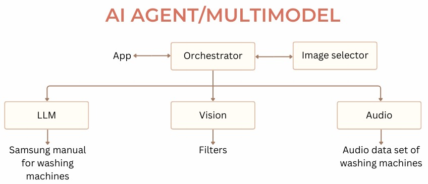
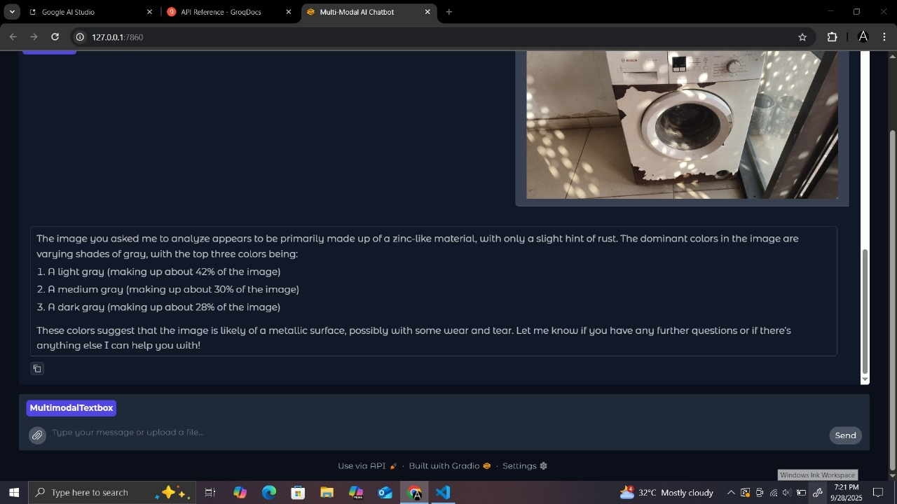
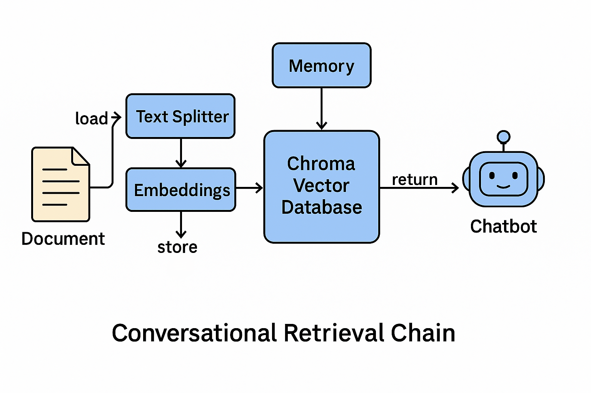
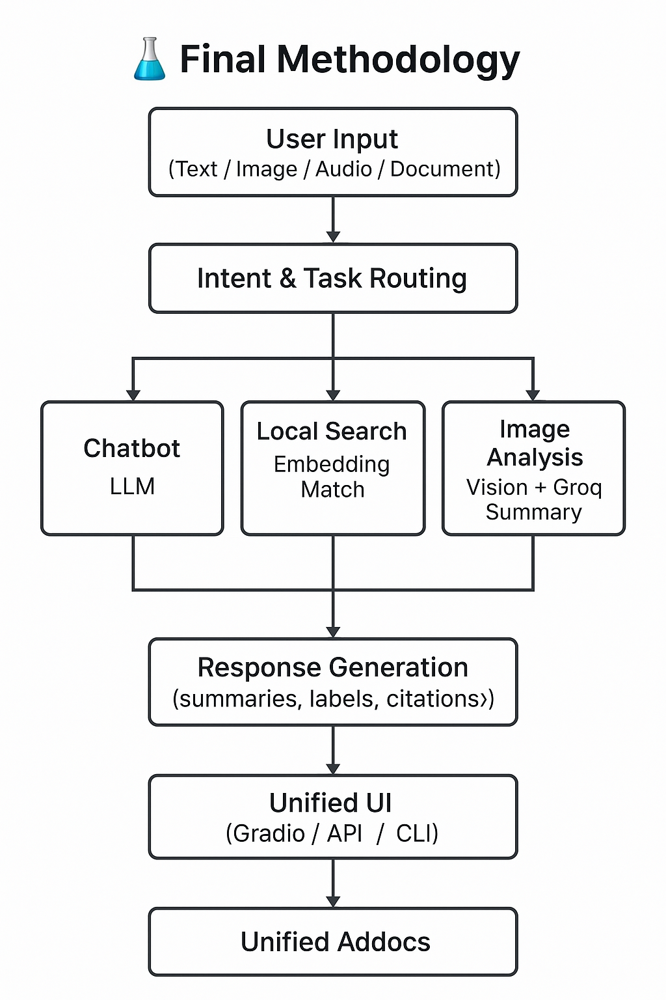
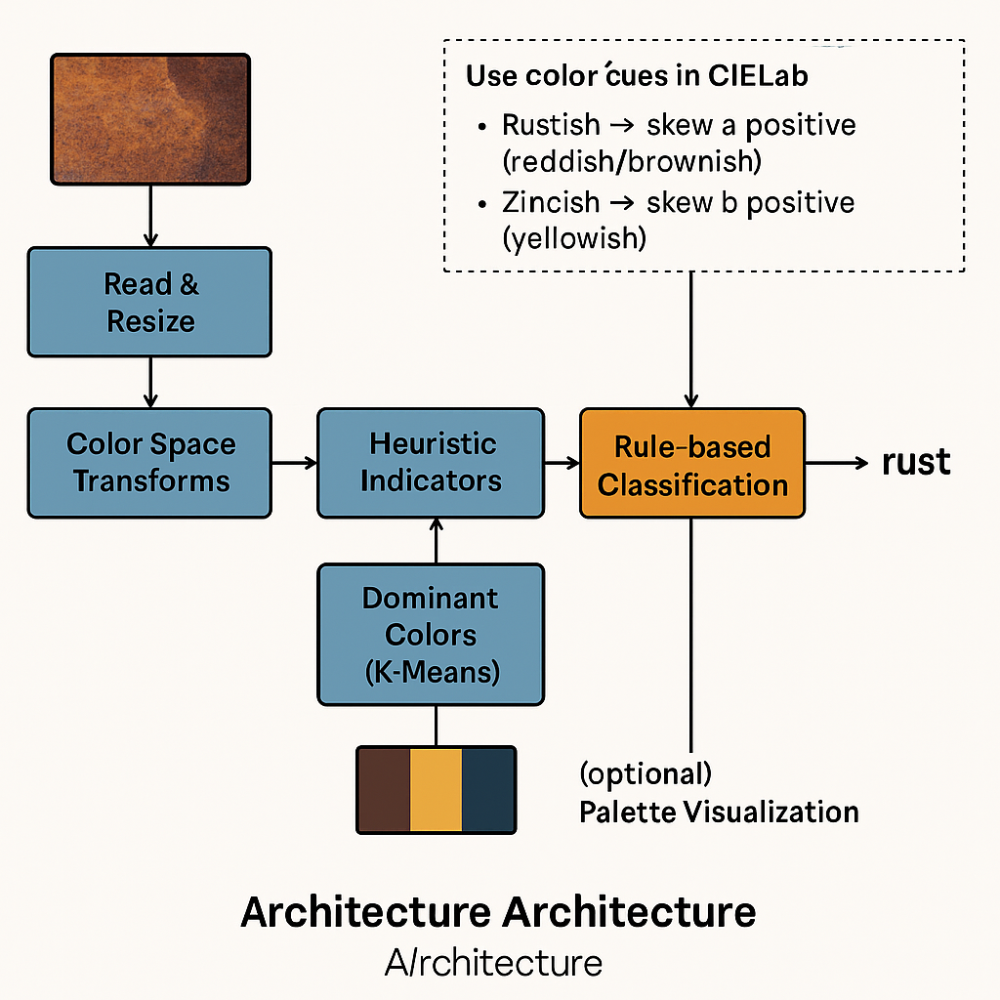
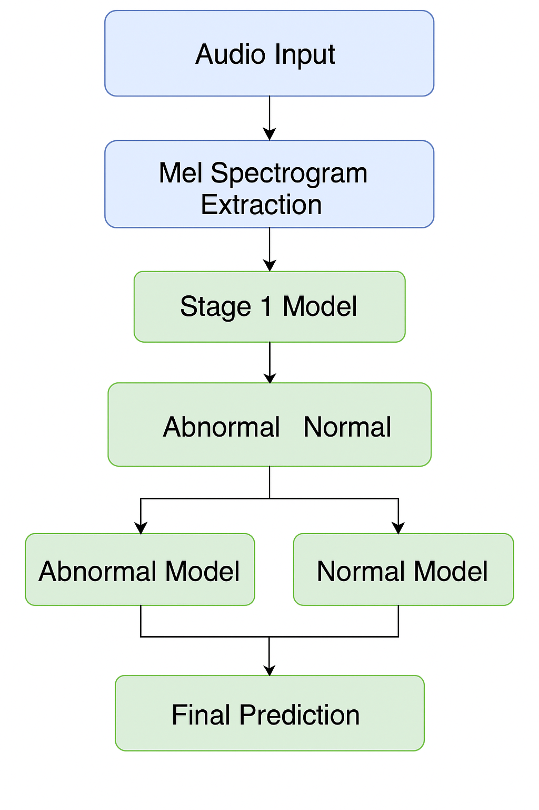

# Kintsugi - Intelligent Washing Machine Diagnostic Application

<div align="center">
  
</div>

## Table of Contents

1. [Overview](#overview)
2. [Core Features](#core-features)
3. [Purpose](#purpose)
4. [Technical Architecture](#technical-architecture)
5. [Installation and Setup](#installation-and-setup)
6. [User Guide and Application Usage](#user-guide-and-application-usage)
7. [Technical Implementation Details](#technical-implementation-details)
8. [Project Structure and Organization](#project-structure-and-organization)
9. [Design System and User Interface](#design-system-and-user-interface)
10. [Quality Assurance and Testing](#quality-assurance-and-testing)
11. [Build and Deployment Configuration](#build-and-deployment-configuration)
12. [Troubleshooting and Problem Resolution](#troubleshooting-and-problem-resolution)
13. [Integrated Artificial Intelligence Services](#integrated-artificial-intelligence-services)
14. [Release Information and Version History](#release-information-and-version-history)
15. [Contributing to the Project](#contributing-to-the-project)
16. [License](#license)
17. [Technical Support and Contact Information](#technical-support-and-contact-information)
18. [Submissions](#submissions)

## Overview

**Kintsugi** is a sophisticated Flutter-based diagnostic application designed to assist users in troubleshooting Samsung washing machine issues through an intelligent chat interface. The application name derives from the Japanese art of Kintsugi, which involves repairing broken pottery with gold lacquer, symbolizing the transformation of damage into beauty. This philosophy reflects our mission to diagnose and resolve washing machine problems effectively while enhancing the user experience.

## Core Features

The Kintsugi application incorporates the following key functionalities:

- **Artificial Intelligence-Powered Chat Interface**: Interactive diagnostic conversations with intelligent response generation
- **High-Quality Audio Recording**: Capture washing machine operational sounds for audio-based diagnostic analysis (WAV format support)
- **Image Attachment System**: Photograph and attach images of washing machine issues with automatic compression capabilities
- **Service Escalation Management**: Submit service requests with automated ticket generation
- **Samsung Brand Integration**: Professional Samsung blue (#1428A0) color scheme implementation throughout the application
- **Mobile-Optimized Design**: Responsive user interface optimized for Android devices
- **Multimedia Processing Support**: Comprehensive handling of images (PNG/JPG), audio (WAV), and text inputs

## Purpose
  
- Solve common repair issues by providing accurate pre-diagnosis for household appliances (limited to washing machine for now)
- Reduce service costs by enabling self-diagnosis and minimizing unnecessary service calls.
- Support technicians by helping them identify issues early, prepare with the right tools, and reduce repeat visits.
- Bridge the gap between users, service teams, and brands like Samsung by integrating AI-powered insights.
- Optimize spare parts inventory and field service operations for service providers.
- Enable remote users to get diagnostic support even in areas with limited access to skilled technicians.

## Technical Architecture

### Frontend Implementation (Flutter/Dart)
- **Development Framework**: Flutter 3.13.0+
- **Programming Language**: Dart
- **User Interface Components**: Material Design with custom Samsung theming implementation
- **State Management Strategy**: StatefulWidget with localized state management
- **Navigation System**: Flutter's native navigation framework

### Application Structure
- `splash_screen.dart` - Application initialization and branding presentation
- `onboarding_screen.dart` - User introduction and configuration setup
- `login_screen.dart` - User authentication interface implementation
- `chat_screen.dart` - Primary diagnostic chat interface
- `escalation_screen.dart` - Service request submission interface

### Service Layer Components
- `kintsugi_api_service.dart` - API communication service implementation
- `escalation_service.dart` - Static escalation ticket management service
- `audio_recorder_service.dart` - Audio recording functionality service

### Primary Dependencies
```yaml
dependencies:
  flutter: sdk: flutter
  cupertino_icons: ^1.0.6
  animated_splash_screen: ^1.3.0
  flutter_svg: ^2.0.7
  google_fonts: ^6.1.0
  provider: ^6.0.5
  http: ^1.1.0
  image_picker: ^1.0.4
  image: ^4.0.17
  flutter_sound: ^9.2.13
  path_provider: ^2.1.1
  permission_handler: ^11.0.1
```

## Installation and Setup

### System Prerequisites

Ensure the following components are installed before proceeding:

- **Flutter SDK** (version 3.13.0 or higher)
- **Dart SDK** (version 3.1.0 or higher)
- **Android Studio** or **Visual Studio Code** with Flutter extensions
- **Android SDK** (API level 21 or higher)
- **Git** version control system

**Important**: For detailed system requirements and advanced configuration options, please refer to the [SETUP_GUIDE.md](SETUP_GUIDE.md) file. For complete dependency specifications, consult the [requirements.txt](requirements.txt) file.

### Installation Process

1. **Repository Cloning**
   ```bash
   git clone https://github.com/AryanSaxenaa/KintsugiNew.git
   cd Kintsugi
   ```

2. **Dependency Installation**
   ```bash
   flutter pub get
   ```

3. **Flutter Environment Verification**
   ```bash
   flutter doctor
   ```

4. **Device Configuration**
   Connect your Android device or initialize an Android emulator

5. **Application Execution**
   ```bash
   flutter run
   ```

### Authentication Credentials for Demonstration
- **Email Address**: user@demo.com
- **Password**: demo123

### Required Android Permissions

The application requires the following system permissions (managed automatically):
- `INTERNET` - Network communication for API integration
- `RECORD_AUDIO` - Audio recording capabilities
- `CAMERA` - Camera access for image capture
- `READ_EXTERNAL_STORAGE` - Gallery image access
- `WRITE_EXTERNAL_STORAGE` - Audio file storage capabilities

## User Guide and Application Usage

### Application Initialization
- Launch the application and complete the onboarding process
- Authenticate using the provided demonstration credentials
- Navigate to the main chat interface for diagnostic interaction

### Chat Interface Operations
- Input text messages to describe washing machine operational issues
- Utilize the attachment functionality (📎) to access multimedia options:
  - **Camera Access**: Capture photographs of the washing machine
  - **Gallery Selection**: Select existing images from device storage
  - **Audio Recording**: Record machine operational sounds for diagnostic analysis

### Audio Recording Procedures
- Select the recording option from the attachment menu
- Record washing machine operational sounds (recommended duration: 5-30 seconds)
- Terminate recording when complete - files are automatically saved in WAV format

### Image Attachment Management
- Images undergo automatic compression to maintain file sizes under 2MB
- Supports PNG and JPG format processing
- Optimal for documenting error codes, machine conditions, and problematic areas

### Service Escalation Process
- Access the escalation function from the application toolbar
- Complete the service request form with the following information:
  - Detailed issue description
  - Customer contact information
  - Equipment model number
  - Priority classification (Critical, High, Medium, Low)
  - Service center selection
  - Additional service requirements
- Submit form to generate a static ticket identification number

## Technical Implementation Details

### Image Processing Capabilities
- **Compression Technology**: Automatic compression algorithms ensure file sizes remain under 2MB
- **Format Conversion**: All images are converted to PNG format for API compatibility
- **Quality Optimization**: Maintains visual fidelity while reducing file storage requirements

### Audio Recording Specifications
- **Audio Format**: WAV (16kHz, mono, PCM16)
- **Recording Duration**: Configurable recording length with user control
- **Storage Management**: Temporary file storage with automatic cleanup procedures
- **Permission Handling**: Runtime microphone permission management

### API Integration Framework
- **HTTP Client**: Custom service implementation for API communication
- **Timeout Management**: 5-minute timeout configuration for all network requests
- **Error Handling**: Comprehensive error management with user feedback mechanisms
- **Response Processing**: JSON response parsing with fallback handling procedures

### Static Escalation System Architecture
- **Ticket Generation**: Local ticket identification generation with timestamp integration
- **Form Validation**: Comprehensive input validation procedures
- **Priority Classification**: Critical, High, Medium, Low priority levels
- **Database Independence**: Self-contained system without external database dependencies

## Project Structure and Organization

```
lib/
├── main.dart                 # Application entry point and initialization
├── screens/                  # User interface screen implementations
│   ├── splash_screen.dart
│   ├── onboarding_screen.dart
│   ├── login_screen.dart
│   ├── chat_screen.dart
│   └── escalation_screen.dart
├── services/                 # Business logic service implementations
│   ├── kintsugi_api_service.dart
│   ├── escalation_service.dart
│   └── audio_recorder_service.dart
└── assets/
    └── app-images/           # Application assets and image resources
        ├── washing-machine.png
        ├── washing-machine.gif
        └── [additional assets]
```

## Design System and User Interface

### Color Palette
- **Primary Color**: Samsung Blue (#1428A0)
- **Background Color**: White (#FFFFFF)
- **Text Color**: Dark Gray (#333333)
- **Accent Colors**: Light blue variations and complementary tones

### Typography Standards
- **Font Integration**: Google Fonts implementation
- **Heading Styles**: Bold, sans-serif font family
- **Body Text**: Regular weight with optimized readability
- **Interface Elements**: Consistent sizing and spacing throughout the application

## Quality Assurance and Testing

### Test Execution Procedures
```bash
# Execute complete test suite
flutter test

# Execute tests with coverage analysis
flutter test --coverage
```

### Manual Testing Protocol
- [ ] Application launches successfully without errors
- [ ] Chat interface responds correctly to user inputs
- [ ] Image attachment and compression functionality operates properly
- [ ] Audio recording functions execute correctly
- [ ] Escalation form submission processes successfully
- [ ] Navigation between screens operates smoothly
- [ ] System permissions are requested appropriately

## Build and Deployment Configuration

### Development Build Process
```bash
flutter run --debug
```

### Production Release Build
```bash
# Generate Android APK
flutter build apk --release

# Generate Android App Bundle (recommended for Google Play Store)
flutter build appbundle --release
```

### Build Output Locations
- **APK File**: `build/app/outputs/flutter-apk/app-release.apk`
- **App Bundle**: `build/app/outputs/bundle/release/app-release.aab`

## Troubleshooting and Problem Resolution

### Common Issues and Solutions

**1. Flutter Environment Configuration Issues**
```bash
flutter doctor
# Follow the recommendations provided to resolve any identified issues
```

**2. Dependency Conflict Resolution**
```bash
flutter clean
flutter pub get
```

**3. Android Build Error Resolution**
```bash
cd android
./gradlew clean
cd ..
flutter run
```

**4. Audio Recording Permission Problems**
- Verify microphone permissions have been granted
- Confirm device audio recording capabilities
- Validate audio file paths and storage permissions

**5. Image Compression Processing Issues**
- Verify supported image file formats (PNG/JPG)
- Check available device storage space
- Ensure proper image picker permissions are configured

## Integrated Artificial Intelligence Services

Kintsugi incorporates four specialized AI services to provide comprehensive diagnostic capabilities:  
- **RAG Samsung Manual Chatbot** (document-based question and answer system)  
- **Multi-Modal Orchestrator** (text, image, and audio processing coordination)  
- **Image Color Classifier** (visual rust and zinc detection analysis)  
- **Hierarchical Audio Classifier** (washing machine sound anomaly detection system)

---

### System Architecture Overview

<table>
  <tr>
    <td align="center" width="50%">
      <br/>
      <sub><b>Kintsugi Application Architecture</b><br/>Flutter Frontend with AI Service Integration</sub>
    </td>
    <td align="center" width="50%">
      <br/>
      <sub><b>Multi-Modal Orchestrator</b><br/>Text / Image / Audio Routing with Groq Summaries</sub>
    </td>
  </tr>
</table>

---

### 1. RAG Samsung Manual Chatbot

<p align="center">
  
</p>

- **Input:** User query (text)  
- **Retriever:** ChromaDB (k=2 chunks per query)  
- **Embeddings:** `all-MiniLM-L6-v2` (Sentence Transformers)  
- **LLM Generator:** `flan-t5-base` (Hugging Face pipeline)  
- **Memory:** Conversational buffer for multi-turn Q&A  
- **Use case:** Ask questions like *“How do I reset my Samsung washing machine?”* and get grounded answers directly from the manual.


**[Check out the model on Huggingface Made by Kintsugi team](https://huggingface.co/spaces/Anvit25/LLM_chatbot2)**

---

### 2. Multi-Modal Orchestrator

<p align="center">
  
</p>

- **Intent Classification**: Rule-based system (`intents.json`)  
  - `"chat"` → Direct to chatbot client  
  - `"search_local_image"` → Execute semantic image search  
  - `"request_image_analysis"` → Vision client with Groq summary  
  - `"request_audio_analysis"` → Audio client with Groq summary  
- **Semantic Image Search**: Embeddings with cosine similarity (threshold 0.4)  
- **Image/Audio Analysis**: AI models → JSON → Summarized by Groq (Llama-3.3-70B)  
- **Conversation Management**: Maintains chat history across text, image, and audio modalities

**[Check out the model on Huggingface Made by Kintsugi team](https://huggingface.co/spaces/Anvit25/Orchestrator_final)**


---

### 3. Image Color Classifier

<p align="center">
  
</p>

- **Processing Pipeline**:  
  1. Input image → conversion to Lab color space  
  2. Compute medians (a*, b*) → thresholds with Δ=6.0  
  3. Ratio calculations:  
     - `rustish_ratio = mean(a* > a_thr)`  
     - `zincish_ratio = mean(b* > b_thr)`  
  4. Rule-based classification:  
     - zinc > threshold → **Zinc**  
     - rust > threshold → **Rust**  
     - else → **Normal**  
- **Additional Features**: K-Means palette (k=3) for dominant color analysis  
- **Output Format**: JSON with class label, ratios, and color palette

**[Check out the model on Huggingface Made by Kintsugi team](https://huggingface.co/spaces/Anvit25/vision-classifier)**

---

### 4. Hierarchical Audio Classifier

<p align="center">
  
</p>

- **Stage 1 (Coarse Classification)**: Normal vs Abnormal detection (CNN on spectrograms)  
- **Stage 2 (Fine Classification)**:  
  - If Normal → classify operational mode (Wash, Spin, etc.)  
  - If Abnormal → classify anomaly type (e.g., Background noise, Dehydration noise, Wash mode noise)  
- **Preprocessing Specifications**:  
  - .wav audio → log-Mel spectrogram (224×224)  
  - Parameters: sr=22050, n_fft=2048, hop=512, n_mels=128  
- **Architecture Design**:  
  - CNN backbone (Conv2D + ReLU + MaxPooling ×3 → Dense → Dropout → Softmax)  
- **Model Artifacts**:  
  - `stage1_model.h5`  
  - `normal_model.h5`  
  - `abnormal_model.h5`  
  - `label_meta.json` (class mapping)

**[Check out the model on Huggingface Made by Kintsugi team](https://huggingface.co/spaces/Anvit25/new_audio)**

---


## Release Information and Version History

### Current Release v1.0.0
-  Complete chat functionality implementation
-  Audio recording with WAV format support
-  Image attachment system with automatic compression
-  Static escalation system implementation
-  Samsung-branded user interface design
-  Android platform compatibility

### Future Development Roadmap
-  Expand to support other electronics
-  Speech-to-text integration capabilities
-  Enhanced artificial intelligence diagnostic features
-  Real-time database integration
-  Push notification system for service updates
-  Multi-language support implementation
-  iOS platform compatibility

## Contributing to the Project

We welcome and encourage contributions to enhance the Kintsugi application. Please follow the established procedures outlined below:

1. Fork the repository to your personal GitHub account
2. Create a feature branch (`git checkout -b feature/EnhancementName`)
3. Commit your modifications (`git commit -m 'Add EnhancementName feature'`)
4. Push changes to your feature branch (`git push origin feature/EnhancementName`)
5. Submit a Pull Request for review and integration

### Development Standards and Guidelines
- Adhere to Dart and Flutter coding standards and best practices
- Implement comprehensive tests for new functionality
- Update documentation to reflect changes and additions
- Maintain responsive design principles throughout the application
- Ensure consistent user interface and user experience patterns

## License

This project is licensed under the MIT License. Please refer to the [LICENSE](https://drive.google.com/file/d/1thqCkaDxxV4KeUlrjxdAw51UxnvaC6_x/view?usp=sharing) file for detailed terms and conditions.

## Technical Support and Contact Information

For technical support and inquiries, please utilize the following communication channels:
- **GitHub Issues**: [Submit an issue](https://github.com/AryanSaxenaa/KintsugiNew/issues)

---

## Submissions

This section contains all relevant project submission materials, including demonstration videos, documentation, and resource links required for project evaluation and review.

### Video Demonstrations

#### Application Demonstration Videos
https://github.com/user-attachments/assets/fbd3002d-30d7-4fa8-8b9a-447a57bc913f

- **Complete Application Demo**: [https://drive.google.com/file/d/1zL5a_xSfD04qAJAcWa1dCmNASkftd7Xt/view?usp=sharing]
- **Technical Architecture Overview**: [https://github.com/AryanSaxenaa/Kintsugi/blob/readme/Kintsugi.pdf]

#### Specialized Models Made by Kintsugi team 
- **Orchestrator**: [https://huggingface.co/spaces/Anvit25/Orchestrator_final]
- **Audio Recording Functionality**: [https://huggingface.co/spaces/Anvit25/new_audio]
- **Image Processing Capabilities**: [https://huggingface.co/spaces/Anvit25/vision-classifier]
- **LLM Chatbot**: [https://huggingface.co/spaces/Anvit25/LLM_chatbot2]

### Documentation and Resources

#### Project Documentation
- **Technical Presentation**: [https://github.com/AryanSaxenaa/Kintsugi/blob/readme/Kintsugi.pdf]


#### Code Repositories and Downloads
- **Primary Repository**: [https://github.com/AryanSaxenaa/Kintsugi]
-  **Orchestrator**: [https://huggingface.co/spaces/Anvit25/Orchestrator_final]
- **Audio Recording Functionality**: [https://huggingface.co/spaces/Anvit25/new_audio]
- **Image Processing Capabilities**: [https://huggingface.co/spaces/Anvit25/vision-classifier]
- **LLM Chatbot**: [https://huggingface.co/spaces/Anvit25/LLM_chatbot2]


#### Additional Materials
- **Setup Guide**: [SETUP_GUIDE.md](SETUP_GUIDE.md)
- **Requirements Specification**: [requirements.txt](requirements.txt)
- **Architecture Diagrams**: [https://github.com/AryanSaxenaa/Kintsugi/blob/main/Kintsugi.pdf]

### Academic and Research Materials
- **Research Paper**: [https://dl.acm.org/doi/10.1145/3297156.3297186]

---

<div align="center">
  <h3>Project Development Information</h3>
  <p>Developed with dedication for Samsung washing machine users worldwide</p>
  <p><strong>Kintsugi</strong></p>
</div>
